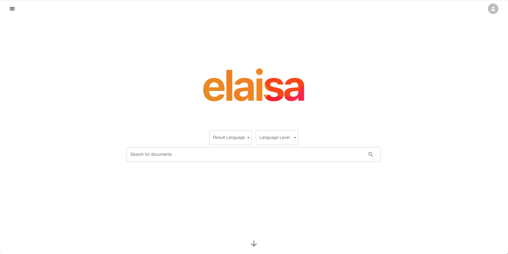
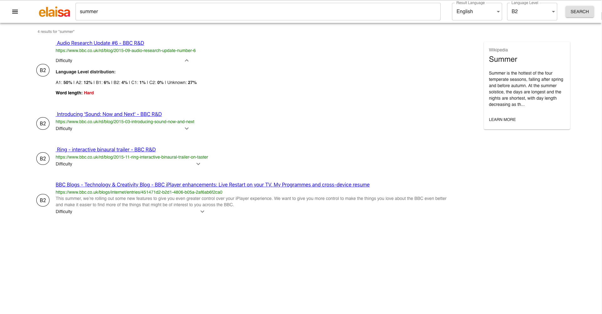

# Elaisa - A language level search engine
Search engine depending on the language level


## Sample Views

**Home Screen**



**Results Screen**



# Start App without Docker

1. `cd services/service-ui/ && yarn && yarn start`
    - **IF YOU WANT TO USE YOUR OWN DATABASE**, it is important to change the API request urls from `api.elaisa.org` to `localhost:8080` in the views: 
        - Results.js
        - SignIn/SignUp.js
        - Account.js
        - Profile.js
    - Otherwise the API calls would use the production API on `api.elaisa.org` 
2. `cd services/service-api && python api.py`
    - **ONLY IF YOU WANT TO USE YOUR OWN DATABASE**
    - If you're on Windows, please check if you can start Python files with `python file.py`
3. Mongo DB should run on `localhost:27017`
    - You have to change the mongo path in the `bin/globals.json` to `mongodb://localhoset:27017/`
4. `cd services/service-cefr/en && python enHandler.py`
5. `cd services/service-crawler && scrapy crawl news_en_EN`
    - You are only able to fill the development database on `localhost:27017`

Now you can visit the application on `localhost:3000` and search for english documents.

# Docker

We use [**Docker Swarm**](https://docs.docker.com/engine/swarm/) as an orchestrator to manage the running containers, which are inlcuded in a [**stack**](https://docs.docker.com/engine/reference/commandline/stack/). This stack could be named as the YAML file: **elaisa**. Therefore we have to tell our server to be a so called **Swarm Manager**; type in the following command: 
- `docker swarm init`

If an error occurs which says, that there are multiple IP addresses, **USE THE INTERNAL IP** since there would be a security risk for you if you use the public one. 

*If you use the server's public IP address for the swarm, other devs could use your server as a swarm worker in their own swarm. This would mean, that they would use your resources for their projects -- bad, right?*

**Build the images:**

After defining the swarm manager, we have to build all containers, which are used by our application:

- `docker build -f build-utils/service-ui.Dockerfile -t service-ui:latest .`
- `docker build -f build-utils/service-api.Dockerfile -t service-api:lastest .`
- `docker build -f build-utils/service-crawler.Dockerfile -t service-crawler:lastest .`

**Create Networks:**

Before we can start the stack, we have to define the [**networks**](https://docs.docker.com/network/) for internal container communication and the mongo db [**volume**](https://docs.docker.com/storage/volumes/) to store the database, even if you upgrade or delete the stack.

Networks:
- [`docker network create --driver overlay --attachable --opt encrypted=true frontend`](https://docs.docker.com/engine/reference/commandline/network_create/)
- [`docker network create --driver overlay --attachable --opt encrypted=true database`](https://docs.docker.com/engine/reference/commandline/network_create/)

With these commands you create the **frontend** network for UI and API and the **database** network for the mongo db and the API. `--opt encrypted=true` says, that all connections in the network are encrypted, which is another safety factor.

Mongo DB Volume:
- [`docker volume create mongodb`](https://docs.docker.com/engine/reference/commandline/volume_create/)

The entire database if now stored in `mongodb:/data/db`.

**Deploy the Docker Stack:**

Now wer're ready to deploy our application.
- [`docker stack deploy -c elaisa.yml elaisa`](https://docs.docker.com/engine/reference/commandline/stack_deploy/)

This will create the docker **services**, which are included in the stack called **elaisa**. You can check if everything is running by typing in: 
- [`docker service ls`](https://docs.docker.com/engine/reference/commandline/service_ls/)

You should see something similar to this: 
``` bash
 NAME                MODE                REPLICAS      PORTS
elaisa_api          replicated          1/1     
elaisa_db           replicated          1/1            *:2717->27017/tcp
elaisa_traefik      global              1/1            *:80->80/tcp...
elaisa_ui           replicated          1/1            
```
If every service says `1/1` in the **REPLICAS** column, everything is running. The **NAME** column tells you which stack is used but you can also check it by typing in: 
- [`docker stack ls`](https://docs.docker.com/engine/reference/commandline/stack_ls/)

```bash
NAME                SERVICES            ORCHESTRATOR
elaisa              4                   Swarm
```
This will show you the following.

Note:\
*There are only two ports shown in the service ls column. This is caused be the use of **[traefik](https://docs.traefik.io/)**. All incoming requests are handled by this reverse-proxy server over port 80. The mongo db is running internal on port 27017 and external on port 2717. Therefore you can visit the mongo db with the following connection string: `mongodb://elaisa.org:2717`.*

**IMPORTANT**\
**SINCE THE STACK IS ALREADY DEPLOYED ON A SERVER WITH THE DOMAIN ELAISA.ORG, YOU CANNOT USE EXACTLY THIS CONFIGURATION!**

If you have questions, don't hesitate to contact me:

Email: teusz.alexander@gmail.com\
Twitter: [@AlexTeusz](https://twitter.com/AlexTeusz)

### Architecture

 
