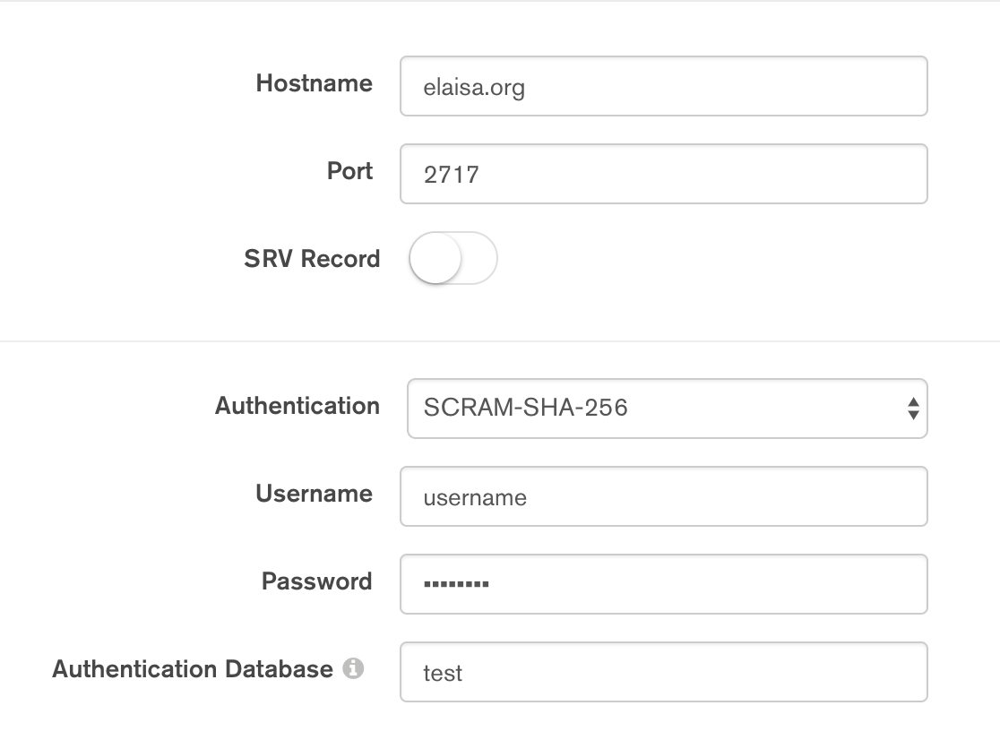

# Mongo DB Configuration

**You only need this description if you want to work with Docker Secrets.**

The `db` service in `elaisa.yml` contains this line in the `volume` section: 

- `- ./init:/docker-entrypoint-initdb.d
`

If initialize a new mongo db you have the ability to run scripts, that, for example, fill the database with given data or create a new user next to the root one. In this case, we want to create a new user, since the **root** user isn't able to create or fill databases; it's only task is to manage the database and users.

You can find a template for this script [here](./init/addUser.js).

To run this script, it has to be located next to your `elaisa.yml` file on the server in the `init` folder:

- Server
    - elaisa.yml
    - init/
        - addUser.js

If you now run `docker stack deploy -c elaisa.yml elaisa` the mongo db will create the user you defined in the Javascript file.

**Important:**

The user is created in the `test` database, which will be the `--authenticationDatabase` when you want to login to the database with this new user. You can check if everything went right by opening [MongoDB Compass](https://www.mongodb.com/products/compass?lang=de-de) and signing in with your new created user -- like in this example: 

Now you will only have access to the configured database -- LanguageLevelSearchEngine